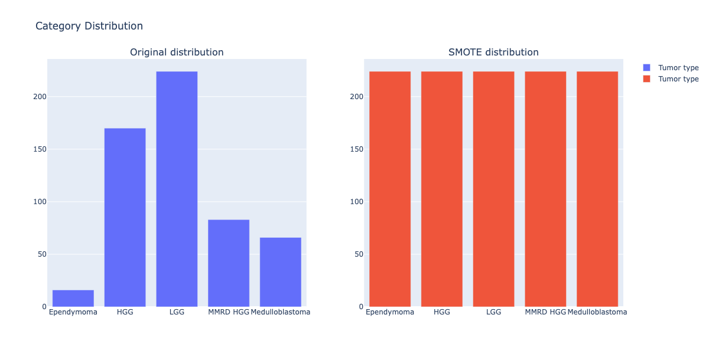
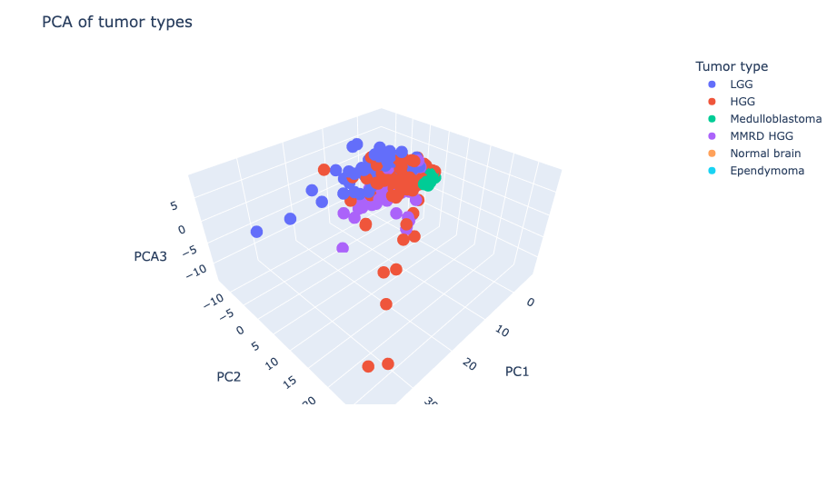
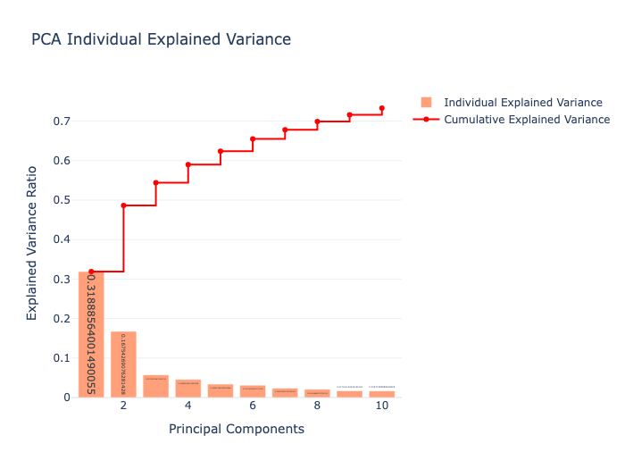
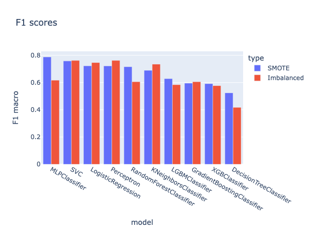
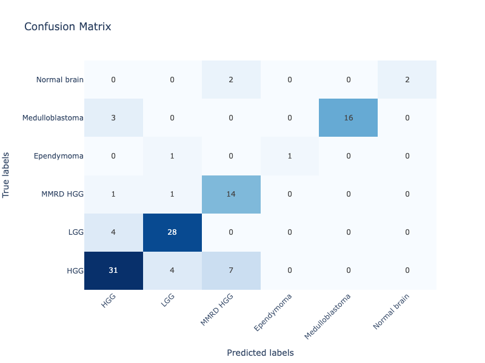
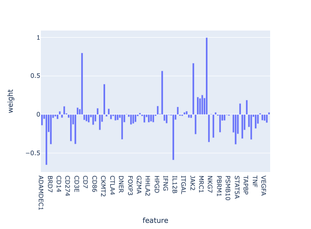

# Classification of pediatric brain tumors

Semestral project for Machine Learning in Bioinformatics course at MFF, Charles University.

Authors: Kostejn Vit, Mihal Filip, 2024.

The work is summarized in the [slides](Bioinformatics_project.slides.html)

## Task

Classify pediatric brain based on Gene Expression data.

Interpret the model and identify the most important genes for each class (binary classificator).

## Data

We used a dataset from a study that analyzed frozen or formalin-fixed paraffin-embedded (FFPE) tissue from 571 patient samples, including 559 pediatric brain tumors and 12 non-tumor brain control samples. The dataset was downloaded from the [Gene Expression Omnibus (GEO) database.](https://www.ncbi.nlm.nih.gov/geo/query/acc.cgi?acc=GSE227756)

## Data preparation & exploration

```python
import GEOparse

# study accession
GeO_key = 'GSE227756'
gse = GEOparse.get_GEO(geo=GeO_key, destdir="./", silent=True)

# get the data
df = gse.pivot_samples('VALUE').T

# get the labels
labels = gse.phenotype_data[['source_name_ch1','characteristics_ch1.0.tumor type']].values
```

**Data:** 571 samples

**Features:** 103 features (gene or protein names) represented by positive integers

**Targets:** Binary classification of pediatric brain tumors + 5 classes of pediatric brain tumors

**Main challenge:** Imbalanced classes





## Data preprocessing

**Normalization:** StandardScaler

**Dimensionality reduction:** PCA

**Oversampling:** SMOTE



## Model selection

In this part we selected multiple classifiers with different hyperparameters, trained them using the train data and evaluated them using F1 score and 5-fold cross-validation.

**Models used:**

- Logistic regression
- Perceptron
- Decision tree
- Random forest
- Gradient boosting
- SVM
- K neighbours
- MLP
- XGB
- LGBM

**Methodology**

Is SMOTE oversampling necessary?

Train-test split: 80-20

Grid search with CV: 5 folds

Scoring: F1 macro

## Results

The best performing model was MLP with 64 neurons and 0.01 learning rate.

**Model:** MLP, 64 neurons, 0.01 learning rate

**Data:** StandardScaler, 44 principal components, SMOTE oversampling



### Analysis of the confusion matrix

Our model primarily struggles with differentiating between high-grade glioma (HGG) and low-grade glioma (LGG), which are similar types of tumors, with HGG being more aggressive. Additionally, the model often confuses MMRD-HGG with HGG. While they are the same type of tumor, MMRD-HGG has a slightly higher mutation rate compared to HGG.



## Feature importance

Feature interpretability for tumor and non-tumor samples

**Approach**

1. Take scaled data (StandardScaler) without dimensionality reduction
2. Train Logistic Regression
3. Coefficients represent feature importance
   - Positive: higher values are more likely to be tumor
   - Negative: lower values are more likely to be non-tumor


